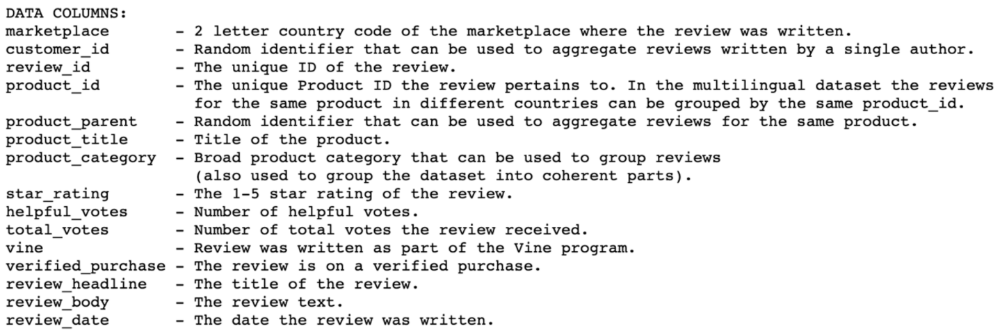
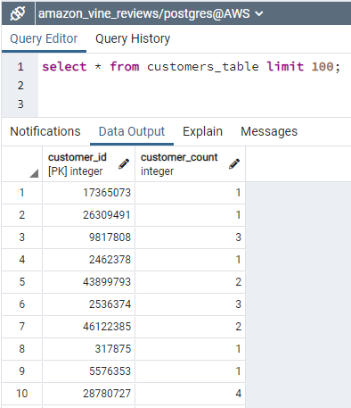
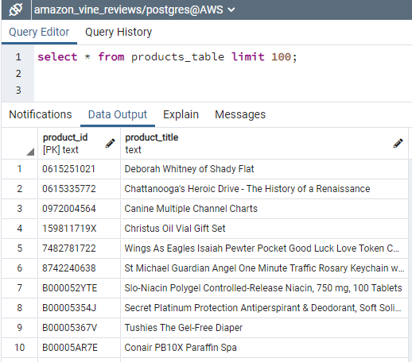
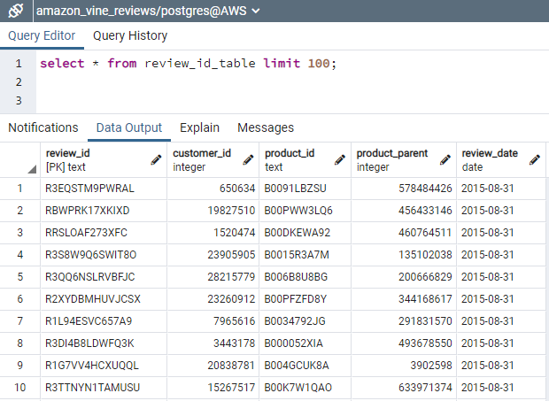
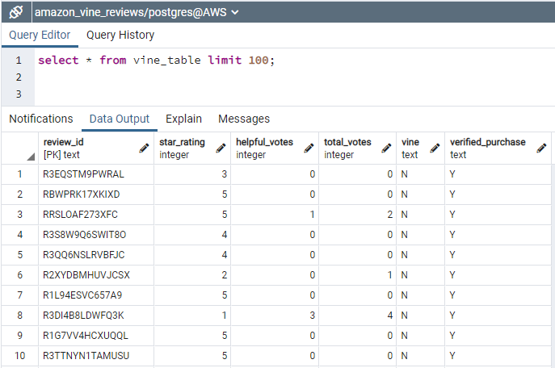

## Big Data Project

## Overview

Build ETL process using PySpark to extract Amazon reviews dataset, transform the data, and load it into an AWS cloud database. The purpose of the analysis was to load a large dataset of Amazon Reviews into an AWS RDS database that could be used for analytic reporting.  The analysis also identified vine (paid) and non-vine (unpaid) reviews and it focused on the percentage of 5-star reviews for each category, paid versus unpaid reviews.

The Amazon reviews dataset is for paid and unpaid reviews for health and personal care products sold on Amazon.

<ins>Amazon Review file layout</ins>

## ETL Process

The pySpark notebook called [Amazon_Reviews_ETL](https://github.com/mwalbers1/Data-Analytics-Bootcamp/blob/main/amazon-vine-analysis/Amazon_Reviews_ETL.ipynb) is responsible for extracting the raw reviews data from the Amazon site. It then transforms and loads the data into a PostgreSQL database hosted on AWS RDS. The tables loaded are listed below.

**customers_table**  

**products_table**  

**review_id_table**  

**vine_table**  

## Analysis
The [Vine Review Analysis](https://github.com/mwalbers1/Data-Analytics-Bootcamp/blob/main/amazon-vine-analysis/Vine_Review_Analysis.ipynb) notebook does analysis on the paid and unpaid reviews from the vine_table.

- There are 497 Vine reviews (paid) and 120,863 non-Vine reviews (unpaid)

- There are 220 5-star Vine reviews and 74,470 5-star non-Vine reviews

- The percentage of 5-star Vine reviews is 0.3%

- The percentage of 5-star non-Vine reviews is 98%

There is a strong bias towards non-Vine 5-star reviews compared to 5-star Vine reviews.  This bias is attributed to the fact that the non-Vine reviews account for over 90% of the entire reviews dataset while the paid reviews only accounts for 0.3% of the entire dataset.

An additional recommended analysis would be to randomly sample 220 non-vine reviews to calculate the 5-star percentage which could be compared to the 5-star percentage of the vine reviews. This could possibly tell is whether vine (paid) reviews have a higher or lower percentage of 5-star reviews as compared to non-vine reviews.
