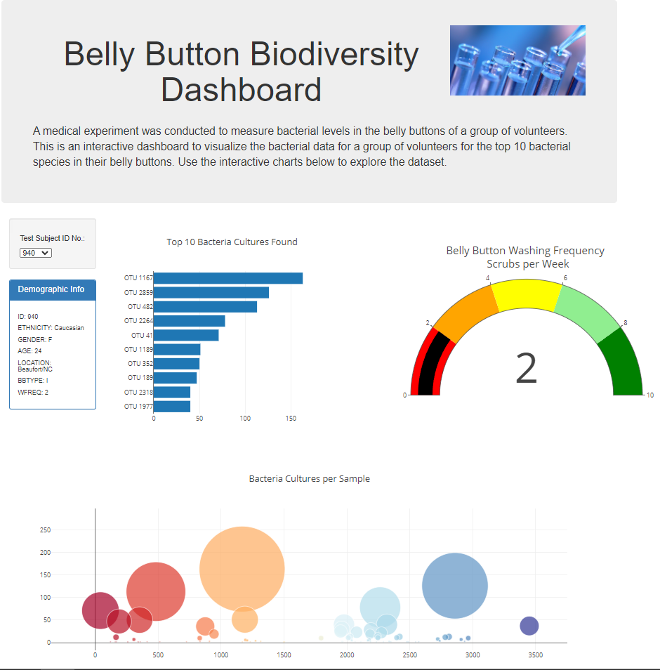

## Data Visualization with JavaScript Project

A fictitious medical experiment is conducted to measure bacterial levels in the belly buttons of a group of volunteers. Create an interactive dashboard to visualize the bacterial data for a group of volunteers for the top 10 bacterial species in their belly buttons.

<ins>Technologies Used</ins>
- JavaScript
- Plotly.js

## Dashboard
Use interactive charts such as Bar, Gauge, and Bubble charts to explore the bacterial biodiversity dataset.

### Horizontal Bar Chart
Displays top 10 bacterial species (OTUs) when a volunteer's ID is selected from a drop-down menu.

### Gauge Chart
Displays Plotly gauge control showing washing frequency data

### Bubble chart
Displays Plotly bubble chart to display bacteria cultures per sample

## Customization of Dashboard
- Mobile-friendly
- Image in header
- Add more information about the project as a paragraph on the page
