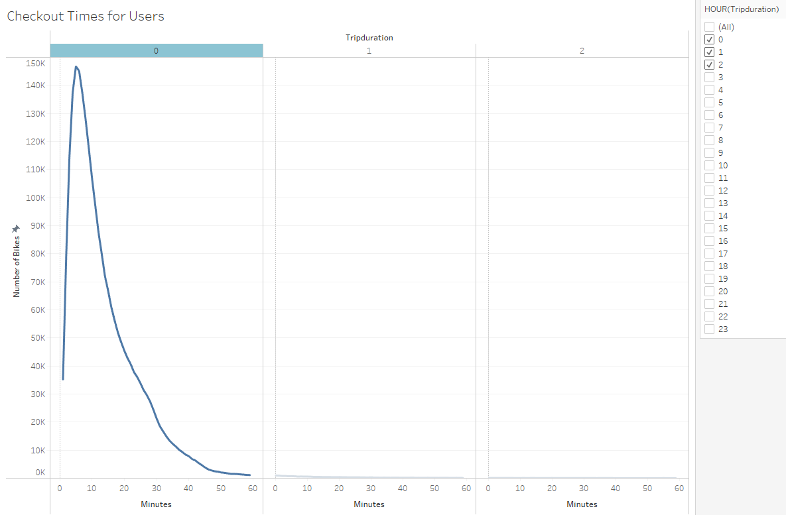
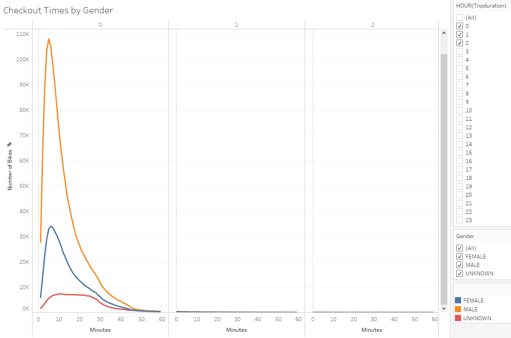
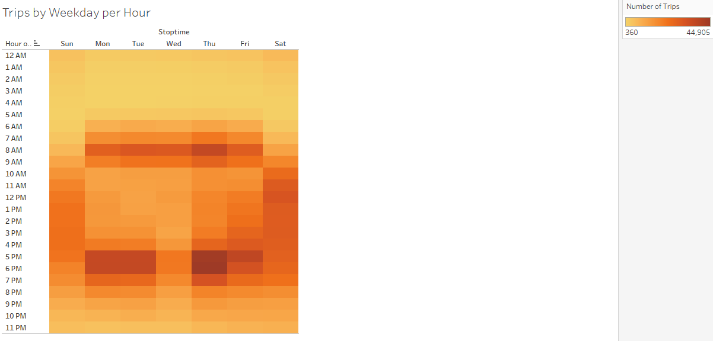
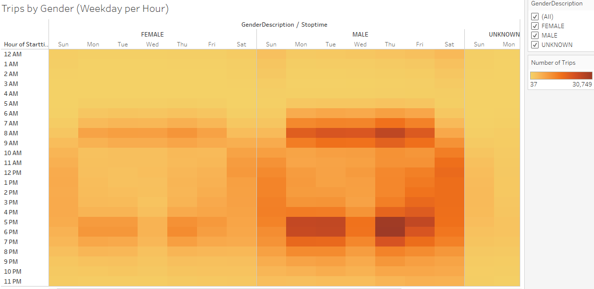
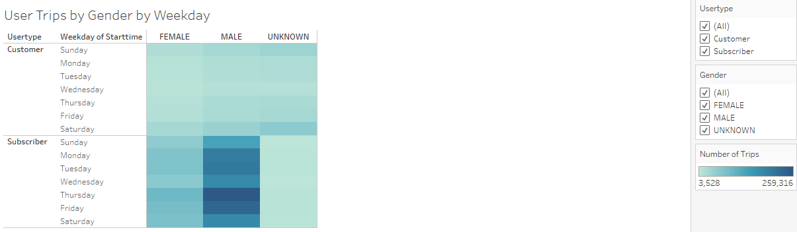
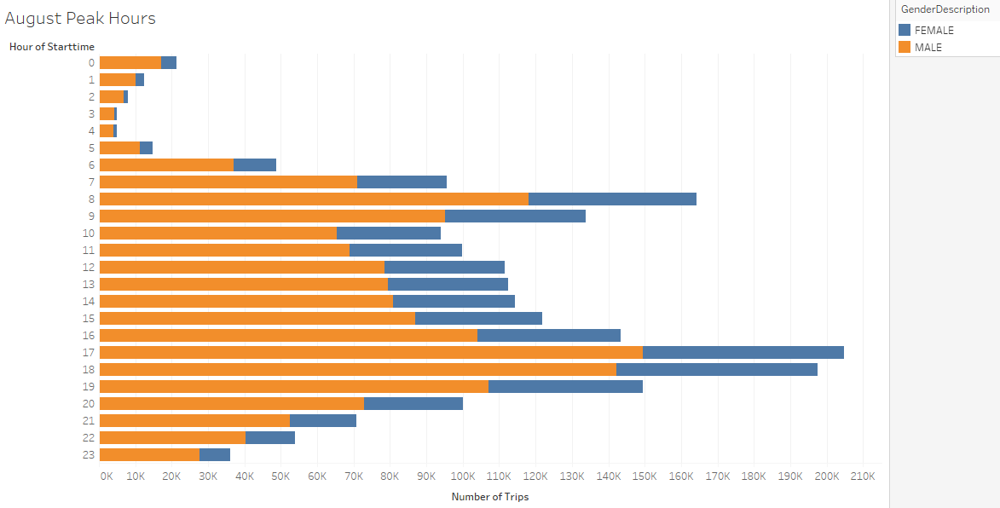
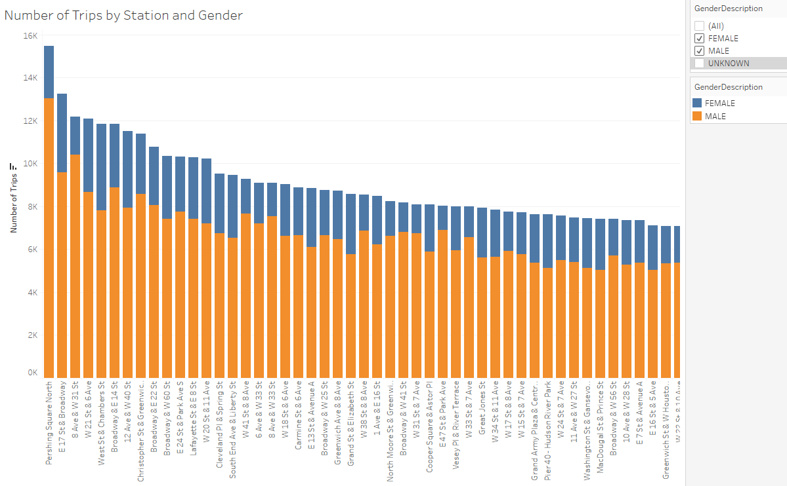

## Bike Sharing Reports with Tableau

Present data stories for a bike-sharing business proposal using Tableau. Use Citi bike-sharing dataset to determine how bike-sharing business in NY city works and how it can be applied to a different state.

<ins>Instructions for downloading dataset</ins>
1. Go to https://www.citibikenyc.com/system-data

2. In the "Citi Bike Trip Histories" section, click the link that says "downloadable files of Citi Bike trip data"

3. Create new `Datasources` sub folder.

4. Scroll down and find the file named `201908-citibike-tripdata.csv.zip`. Unzip this file and save CSV file to the `Datasources` sub-folder.

## Overview of Analysis

Explore the Citi bike-sharing business in NY city and identify trends in bike usage across gender, time of day, and station locations.

## Tableau Visualization Results

#### 1. Checkout Times for Users

The total number of trips for the month of August is 2,344,224. The total number of trips where the trip duration is less than one hour is 2,316,710. This accounts for 99% of all bike trips in the month of August. This could be due to the fact that most destinations in NY city such as business, place of employment, stores, and restaurants are in close proximity to the Citi bike stations.
    
#### 2. Checkout Times by Gender

    

The total number of trips by hour is broken out further by gender.  The male bike riders far exceeds the number of female bike riders. It appears that both male and female bike riders have a peak trip duration between 9 and 10 minutes.

#### 3. Weekday Trips per Hour

The bike usage is most prevalent during the work week between Monday and Friday and on the weekends on Saturdays. This visualization shows lower bike rentals occurring on Sundays.
    
#### 4. Weekday Trips by Gender per Hour

    

The Weekday Trips per hour is displayed by gender. Both male and female bike riders show the same pattern of frequent bike trips happening during the work week, Monday through Friday and on Saturdays. It also shows that the number of male bike riders far exceeds the number of female bike riders.
    
#### 5. User Trips by Gender by Weekday

    

In this visualization most bike trips are occur during the work week, Monday through Friday and on Saturdays. It shows that the majority of these bike riders have paid subscriptions.
    
#### 6. August Peak Hours by Gender

    

Both male and females ride bikes more often during peak hours 6 am to 8 am and during 5 pm to 7 pm.
    
#### 7. Number of Trips by Station and Gender
    

    
This visualization displays bike stations with the highest volume of bike riders by gender. We see the number of male bike riders far exceeds the number of female bike riders at each of these stations.

## Final Summary

The number of male bike riders is more than double the number of female bike riders.  The majority of bike riders are subscribers. The analysis tried to uncover any scenario where the number of female riders was close to that of male bike riders. In each visualization, male bike riders exceeds the number of female bike riders by at least double the number of female riders. In the final visualization, there was not a single bike station where the number of female bike riders was close to that of the male bike riders.

Two additional visualizations can be created to show the number of trips by gender and birth year. This will help identify which female age group has the lowest number of bike riders. A potential marketing campaign could then be geared towards this female age group.  A second report showing the number of trips by user type and gender can help answer the question of what percentage of female bike riders are subscribers. This can then be compared to the male subscriber population to see if the percentages are similar.

[Citi-Bike Sharing Story](https://public.tableau.com/views/Citi-BikeSharingStory/Citi-BikeSharingStory?:language=en-US&publish=yes&:display_count=n&:origin=viz_share_link)

