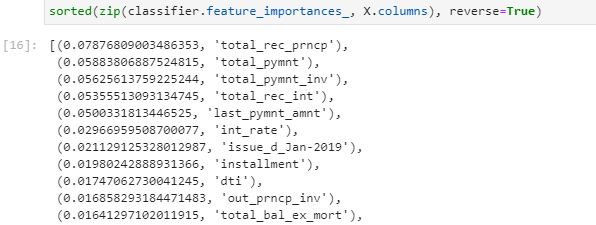

## Supervised Machine Learning Project

### Purpose of Analysis
The credit card dataset from LendingClub, a peer-to-peer lending services company is unbalanced. There are far more low-risk than high-risk observations in the dataset. This analysis will use different resampling techniques and classification models to predict credit risk. Evaluate each model's balanced accuracy score and their imbalanced precision and recall scores.

### Credit Risk Prediction Results

- Re-sample dataset using oversampling, undersampling, and combination techniques
- Create accuracy score, confusion matrices, precision and recall scores for six machine learning models.

#### Machine Learning Models
**Jupyter notebooks:** [credit_risk_resampling](credit_risk_resampling.ipynb), [credit_risk_ensemble](credit_risk_ensemble.ipynb)

| Classifier                | Accuracy Score | Precision Score | Recall Score |
|---------------------------|----------------|-----------------|--------------|
| **Naive Random Oversampling** |           0.66 |      0.99       |  0.60        |
| **SMOTE Oversampling**        |           0.66 |      0.99       |  0.69        |
| **Undersampling**             |           0.54 |      0.99       |  0.40        |
| **Combination sampling**      |           0.64 |      0.99       |  0.58        |
| **Balanced Random Forest**    |           0.79 |      0.99       |  0.87        |
| **Easy Ensemble AdaBoost**    |           0.93 |      0.99       |  0.94        |

### Summary

All six machine learning models have excellent precision scores but this is due to the fact that there are a high number of False positives.  A high number of False positives means that the model will incorrectly classify an applicant as a high credit risk and consequently deny the loan application.  As a result, the loan business could lose many potential clients as the rejected applicants will apply elsewhere for loans. So in this business scenario, the goal is to choose a model that has both a high overall accuracy and recall score.  

The best model to choose would be the `Easy Ensemble AdaBoost` model which employs AdaBoosting (Adaptive Boosting) in making its predictions. The `Easy Ensemble AdaBoost` model has Recall score of 94% and accuracy score of 93%. Both scores are far greater than the other five models.

The most important feature determined by the `Balanced Random Forest` classifier is **Total Received Principal**.

