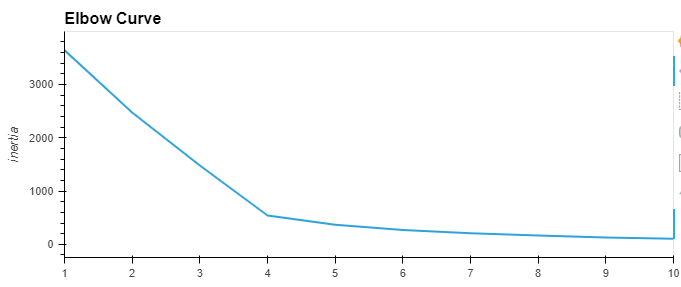
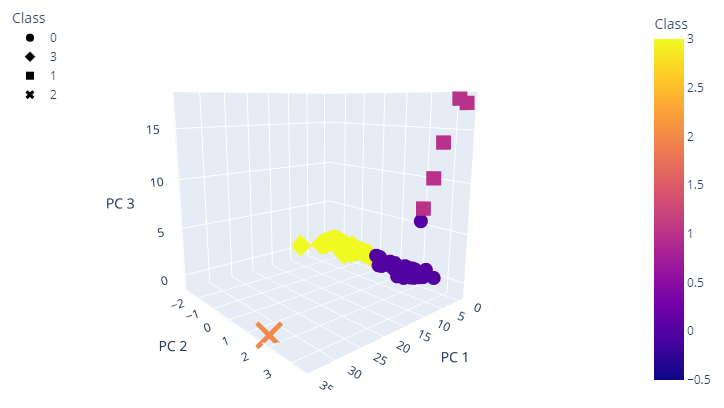
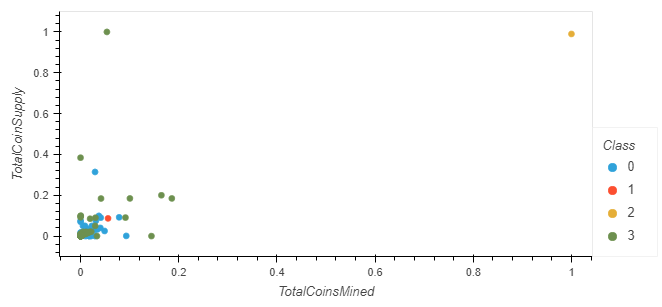

## Unsupervised Machine Learning Project

Create a classification system for a new cryptocurrency investment portfolio using Unsupervised Machine Learning. The dataset contains several different Cryptocurrencies, some of which are not trade-able. The goal is to identify the trade-able Cryptocurrencies and then create a classification system for grouping similar cryptocurrency records.

## There are four stages of this project:

### 1. Preprocess dataset

Identify and remove any null values in the dataset. The categorical data is encoded into numeric values. The numeric columns are then scaled using the `MinMaxScaler` class.

### 2. Reduce dimensions of dataset Using PCA (Principal Components Analysis)

### 3. Create K-Means Machine Learning model to group Cryptocurrencies

 
***Elbow Curve plot to determine optimal number of clusters to run K-Means algorithm***

### 4. Visualize Cryptocurrencies results

##### 3D Plot of PCA components

##### Scatter plot on Total Coins Supply and Total Coins Mined

