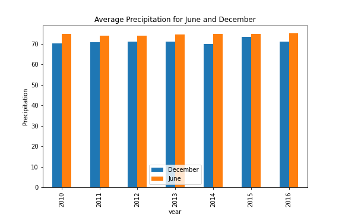

## Surfs Up Climate Analysis

Use SQLAlchemy to query and analyze weather data for Hawaii that is stored in a SQLite database. 

### Overview
The purpose of the analysis was to determine whether a new surfing store could be profitable in the month of December. The weather for the month of 
December was compared to the month of June. The analysis revealed that average temperatures in June are about four degrees higher than December 
average temperatures over a span of six years.

#### Differences in weather between June and December

1. The overall mean June temperature across all years is higher than the December overall mean temperature.  The difference in overall means between June and December is about four degrees.

2. The overall median temperature in June exceeds the December overall median by four degrees. This confirms that the temperature observations for June and December are not skewed. The standard deviation for both June and December is less than four which indicates that most temperature observations are less than four degrees from the mean.

3. There are approximately 200 more temperature observations for June than in December. There are no 2017 temperature observations for the month of December.

#### Summary

The June temperature and precipitation averages (both mean and median) are roughly four to five degrees higher than the month of December both at an aggregate level across all years and at the yearly level.

While the December temperatures can be about five degrees lower than in June, at least half of all December temperature observations equals or exceeds 71 degrees. It appears that a new store could profit in the month of December with an understanding that it will not meet expectations set for the month of June.

##### Average and Median Temperatures for June and December

The mean and median for the month of June exceeds December by two to five degrees each year

##### Average and Median Precipitation for June and December

We see a similar pattern to the temperature observations in that June precipitation exceeds December precipitation levels by two to five units each year.

