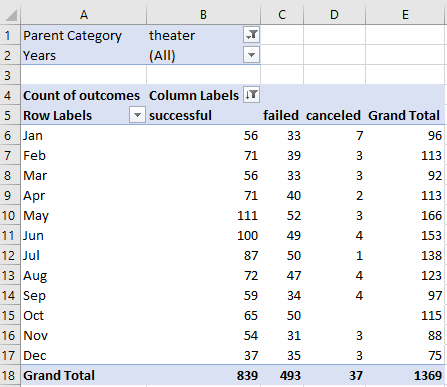
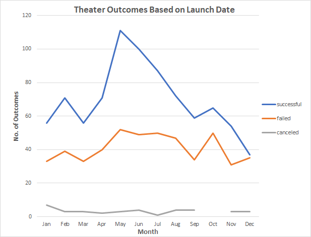
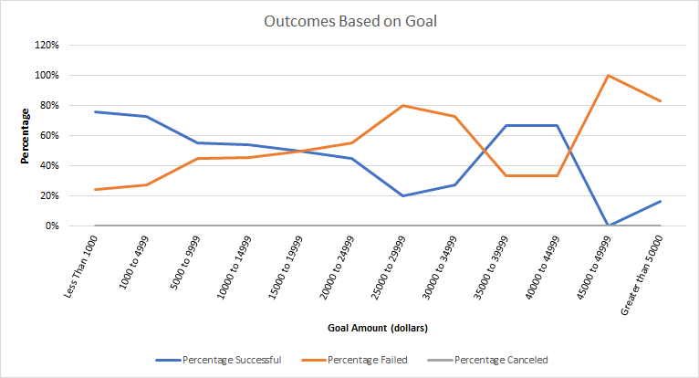

# Kickstarting with Excel

## Overview of Project
Perform data analysis of kickstarter campaigns with Excel. The **Kickstarter_Challenge.xlsx** in this project uses functions only available in Excel 365. It is therefore recommended to open **Kickstarter_Challenge.xlsx** in <a href="https://www.microsoft.com/en-us/microsoft-365/excel" target="_blank">Excel 365</a>

### Purpose
Determine how successful fundraising campaigns were for plays.  Use Excel pivot charts to visualize campaign outcomes for plays based on launch date and their funding goals.

## Analysis and Challenges

### Analysis of Outcomes Based on Launch Date
A pivot table was created to filter on category of `theater` and years.  The rows showed the month of the year with the outcomes listed as columns. The counts of each outcome column were calculated for each month.

A pivot line chart was created in order to display the number of success, failure, and cancel outcomes for each month of the year.

### Analysis of Outcomes Based on Goals
The number of successful, failed, and canceled outcomes were calculated based on twelve goal ranges including goal amounts less than $1,000 dollars, greater than $50,000 dollars, and goal amounts between $1,000 and $50,000 dollars. The percentage of success, fail, and cancel outcomes were calculated based on the total number of projects in each goal range.

An Excel line chart was created for success, fail, and cancel outcome percentages based on each of the goal amount ranges.

### Challenges and Difficulties Encountered
The `Outcomes Based on Goals` Excel sheet has a lot of formulas for counting the number of success/fail/canceled plays for different goal ranges which took a lot of time to manually enter and verify each formula.  The goal ranges in the first column are hard-coded making it challenging to maintain and to support future changes to the goal ranges. It will also be challenging to add a similar analysis for pledged amount ranges in the future, if the need arises.

## Results

- What are two conclusions you can draw about the Outcomes based on Launch Date?
>The best time to initiate a theater campaign is from May through September which reflect the highest number of success outcomes for the year. The failure outcomes are flat during the same period between May and September.

>The worst time period for a theater campaign appears to be in the final quarter of the year between October and December.

- What can you conclude about the Outcomes based on Goals?
>It is recommended that the funding goal should not exceed $15,000 for plays. For goal amounts
between $15,000 and $35,000 dollars, the success rate is between 20% and 50%, while the percentage of success ranges from 54% up to 76% for goal amounts less than $15,000 dollars.

>There is a high success rate of 67% for goal amounts ranging from $35,000 dollars to $45,000 dollars, however there were only nine plays that met this criteria which represents a very small portion of the overall number of plays.

- What are some limitations of this dataset?
>The dataset lacks information on the type of campaign spending needed for a successful outcome such as infrastructure, marketing, and operational spending. The dataset does not include whether the campaigns occur in cities or in rural areas which could help explain the level of goal amounts.

- What are some other possible tables and/or graphs that we could create?
>A box whisker plot could have been created to help identify outliers in the dataset and to determine if the data was skewed. For the `Theater Outcomes by Launch Date` Excel sheet, a second pivot table showing percentage of outcomes would have been helpful in displaying success, fail, and cancel outcomes as percentagee of the grand totals by month.