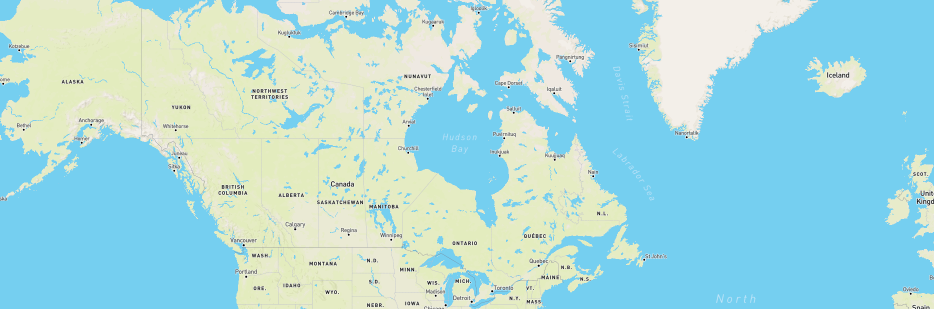
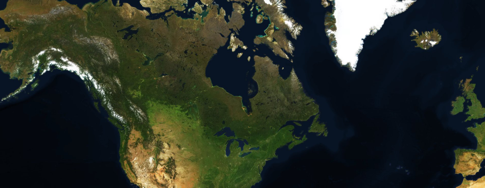
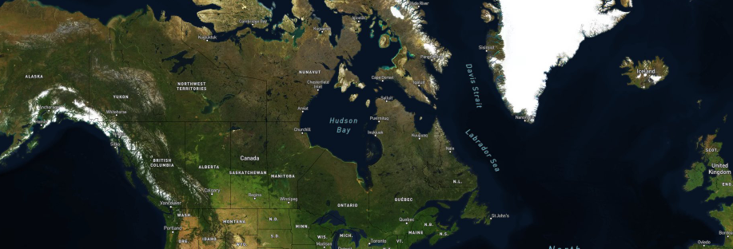
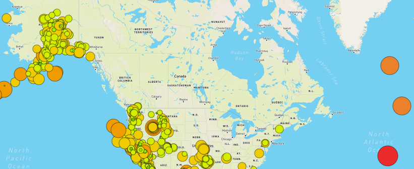
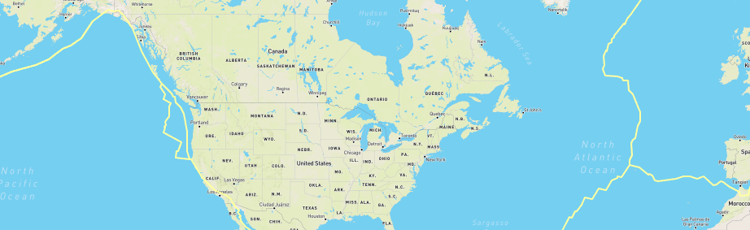
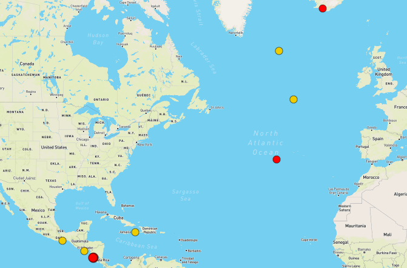

## Mapping Earthquakes

The purpose of this repository is to map earthquake geoJSON data. The earthquake GeoJSON data is retrieved from <a href="https://earthquake.usgs.gov/earthquakes/feed/v1.0/geojson.php" target="_blank">USGS Earthquake Hazards Program</a>

## Tile Layers

The earthquakes map consists of three Tile Layers which are from the MapBox API.

<ins>Streets Layer</ins>

<ins>Satellite Layer</ins>

<ins>Satellite Streets Layer</ins>

These three layers can be toggled on and off from the Layers Control located in the upper right of the map

## Overlays

 Overlays are anything that you want to add to the map, which are "laid over" all the base layers. The three overlays available for this map are: 
 
<ins>Earthquakes</ins>

 
<ins>Tectonic Plates</ins>

 
<ins>Major Earthquakes</ins>

 

All three overlays can be toggled on and off in the Layer Controls in the upper right corner of the map
 
 
