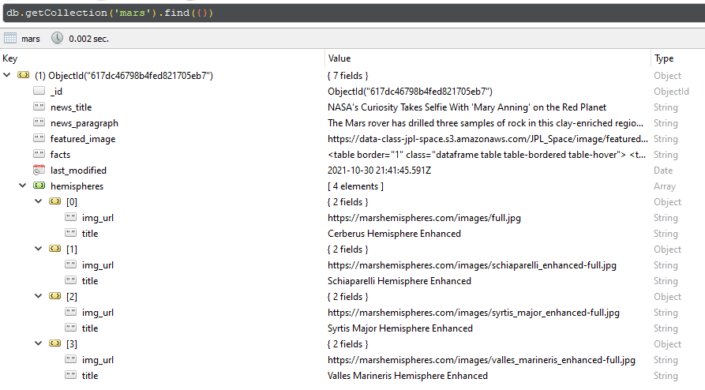
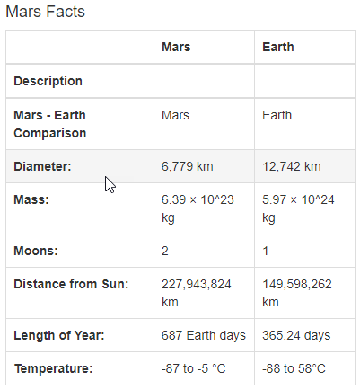
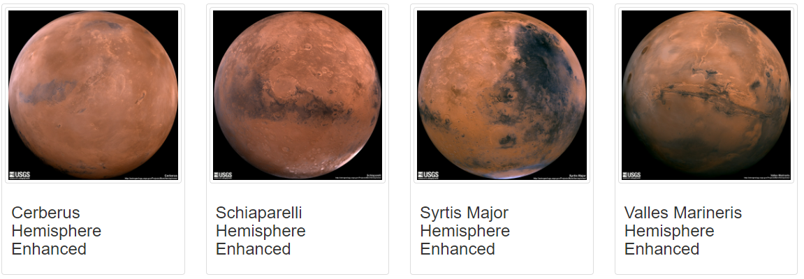

## Mission to Mars Project
Build a Flask web application that will scrape different websites for data pertaining to a mission to plant Mars.

<ins>**Technologies Used**</ins> 

- Web Scraping with Python Beautiful Soup and Splinter
- Create MongoDB NoSQL database to store raw data from web scraping
- HTML/CSS portfolio to display project
- Bootstrap components

## Web Scraping with Splinter and Beautiful Soup packages

- Scrape full-resolution Mars hemisphere images and titles from the <a href="https://marshemispheres.com" target="_blank">Mars hemispheres</a> site

- Store raw data from web scraping into MongoDB NoSQL database for retrieval on subsequent visits to web application

## Update Web App with Mars hemisphere images and titles

- Flask route called `/scrape` will retrieve a collection of images and titles from MongoDB collection called `mars`

- Display scraped data onto Web App

- Click button called `Scrape New Data` to initiate process to scrape data images and titles and perform `upsert` function to MongoDB collection

## Add `Bootstrap 3` Components

1. Make `Scrape New Data` button an active button with `active` Bootstrap class

2. Highlight rows in Mars Facts table on mouse hover using `.table-hover` Bootstrap class

    

3. Display Mars hemisphere images in thumbnail size

    
    

## Mobile-Responsive Experience

The Web App is responsive on mobile devices. Below is a mobile experience on an iPhone 6 Plus.

