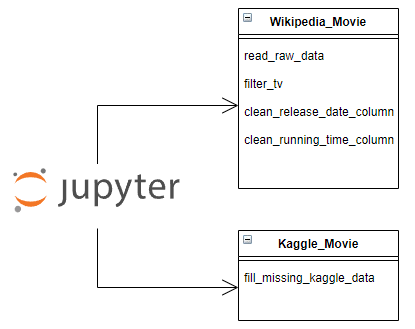

## ETL (Extract, Transform and Load) Process

### Overview
Refactor [movies-etl notebook](movies-etl.ipynb) from Module 8 exercises into an automated data pipeline.

 
*Image source*: www.freepik.com

### Movie Source files 
- Wikipedia data

- Kaggle Metadata

- The ratings data comes from Movielens, extracted from a Kaggle dataset:
<a href="https://www.kaggle.com/rounakbanik/the-movies-dataset" target="_blank">https://www.kaggle.com/rounakbanik/the-movies-dataset</a>. The data contains over 26 million user ratings on a collection of movies.

## Automate ETL Data Pipeline

Two Python classes were developed for the Wikipedia and Kaggle movie source files:
- Wikipedia_Movie
- Kaggle_Movie

The `extract_transform_load` function in the Jupyter notebook calls methods in the **Wikipedia_Movie** and **Kaggle_Movie** classes. Using Python classes allows for a "separation of concerns" design so that code specific to each source file can be tested and maintained in isolation of the other source files. Also, this makes it easier to add new source files in the future as new classes to the ETL data pipeline.

### Deliverable 1
[ETL_function_test](ETL_function_test.ipynb) - Reading movie source files into Pandas DataFrames

### Deliverable 2 
[ETL_clean_wiki_movies](ETL_clean_wiki_movies.ipynb) - Extract and Transform Wikipedia Data

### Deliverable 3
[ETL_clean_kaggle_data](ETL_clean_kaggle_data.ipynb) - Extract and Transform Kaggle Data

### Deliverable 4
[ETL_create_database](ETL_create_database.ipynb) - Load Movie and Ratings data to Postgres database

