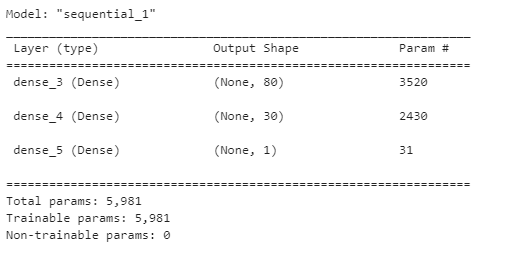

# Neural Network Charity Analysis

## Overview

Create a binary classifier for a dataset containing over 34,000 organizations that have received funding from Alphabet Soup. A neural network model will be designed to create the binary classifier that can predict if an Alphabet Soup–funded organization will be successful based on the features in the dataset. The model will be optimized to achieve a target accuracy score of 75% or better.

<ins>**Alphabet Soup Charity Dataset**</ins>
* EIN and NAME—Identification columns
* APPLICATION_TYPE—Alphabet Soup application type
* AFFILIATION—Affiliated sector of industry
* CLASSIFICATION—Government organization classification
* USE_CASE—Use case for funding
* ORGANIZATION—Organization type
* STATUS—Active status
* INCOME_AMT—Income classification
* SPECIAL_CONSIDERATIONS—Special consideration for application
* ASK_AMT—Funding amount requested
* IS_SUCCESSFUL—Was the money used effectively

## Data Preprocessing
The categorical data was encoded into numeric form using the scikit-learn OneHotEncoder class. The less frequently occurring categorical values for Classification Type and Application Type were binned as "Other". The numeric columns were scaled using the scikit-learn StandardScaler class. The final preprocessed data-frame has 44 feature columns

## Compile, Train, and Evaluate Model
The initial model was created with one input layer, two hidden layers and one output layer. The initial configuration for the hyper-parameters are:

