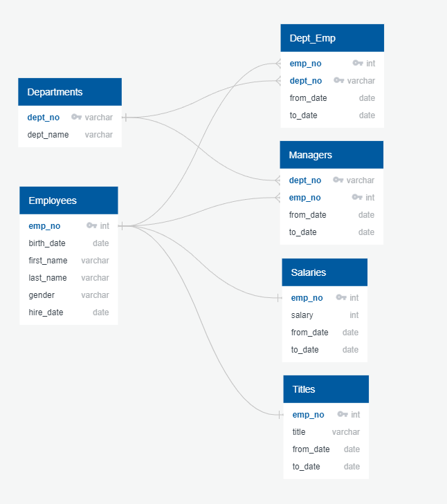

# Employee Database and SQL Project

Retrieve data from a Postgres SQL Database and derive interesting, accurate results from the output of the queries.  

## Entity Relationship Diagram (ERD)
**Physical ERD of Employee Database**




### The Number of Retiring Employees by Title

#### Queries to build the retiring_titles table

**Query 1**

```sql
-- Join employees table to titles table
SELECT emp.emp_no, emp.first_name, emp.last_name,
		ti.title, ti.from_date, ti.to_date
INTO retirement_titles
FROM employees as emp
INNER JOIN titles as ti ON emp.emp_no = ti.emp_no
WHERE (emp.birth_date BETWEEN '1952-01-01' AND '1955-12-31')
ORDER BY emp_no;
```


**Query 2**

```sql
-- Use Dictinct with Orderby to remove duplicate rows
SELECT DISTINCT ON (emp_no) emp_no, first_name, last_name, title
INTO unique_titles
FROM retirement_titles
WHERE to_date = '9999-01-01'
ORDER BY emp_no;
```


**Query 3**

```sql
-- Number of employees by their most recent job title
SELECT COUNT(emp_no) "Count", title
INTO retiring_titles
FROM unique_titles
GROUP BY title
ORDER BY "Count" DESC;
```


### The Employees Eligible for the Mentorship Program

#### Mentorship table

```sql
-- Join employees to dept_emp and titles table
SELECT DISTINCT ON (emp.emp_no) emp.emp_no, emp.first_name, emp.last_name, emp.birth_date,
	de.from_date, de.to_date, ti.title
INTO mentorship_eligibilty
FROM employees as emp
INNER JOIN dept_emp as de ON emp.emp_no = de.emp_no
INNER JOIN titles as ti ON emp.emp_no = ti.emp_no
WHERE de.to_date = '9999-01-01'
AND emp.birth_date BETWEEN '1965-01-01' and '1965-12-31'
ORDER BY emp.emp_no;
```


### Employee Database Analysis

The "silver tsunami" is a term indicating that many employees will soon reach a retirement age. The company HR manager will need to fill a lot of open roles.

- There are not enough non-retiring employees at the lower ranks of Staff and Assistant Engineering roles. The non-retiring Engineers comprise 36 percent of non-retiring Senior Engineer roles which makes it difficult to fill senior engineer positions internally.  The non-retiring staff roles is 31 percent of the non-retiring Senior Staff roles.

- The number of senior retiring titles far exceeds the number of people retiring in lower level roles. The number of Senior Engineers retiring is more than double the number of retiring Engineers. The number of Senior Staff roles retiring is more than three times of retiring Staff roles.  This is positive as it shows that people have risen to senior levels at the company.

- The number of retiring Senior Engineers exceeds the number of non-retiring engineers by about four thousand meaning that there are not enough internal non-retiring engineers to fill the vacancies left by the retiring senior engineers. The same concern exists with retiring senior staff, the number of retiring senior staff roles exceeds the number of non-retiring staff roles by more than 7,000 making it hard to fill the senior staff position openings internally.

- There are too few Assistant Engineers working for the company. This may be positive in that it shows that employees get promoted into engineering and senior engineering roles. However, after promoting engineers into senior engineer roles, the company ends up with a huge shortage of engineers.  There needs to be a shift towards hiring more assistant engineers going forward.  Since these are entry level positions, they should be easier to fill than the more senior roles.<br/>
<br/>


**Comparison of retiring and non-retiring title counts**

| title              | retiring_count | non_retiring_count | ten_pct_attrition | retiring_count_minus_attr |
|--------------------|----------------|--------------------|-------------------|---------------------------|
| Senior Engineer    | 25,916          | 60,023              | 2,592              | 23,324                     |
| Senior Staff       | 24,926          | 57,098              | 2,493              | 22,433                     |
| Engineer           | 9,285           | 21,698              | 929               | 8,356                      |
| Staff              | 7,636           | 17,890              | 764               | 6,872                      |
| Technique Leader   | 3,603           | 8,452               | 360               | 3,243                      |
| Assistant Engineer | 1,090           | 2,498               | 109               | 981                       |
| Manager            | 2              | 7                  | 0                 | 2                         |

### Filling Open Roles

#### Senior Engineers

There are currently 21,698 Engineers born on or after January 1st 1956 who are considered non-retiring employees. If we assume every non-retiring Engineer becomes a Senior Engineer then there would be 4,218 Senior Engineer open roles to fill. The company would also need to hire 9,285 engineers to replace the retiring engineers and then hire an additional 21,698 engineers to replace the vacancy created in filling the Senior Engineer roles. To gain significant progress, the HR manager should consider hiring an additional 30,000 engineers and about 4,000 Senior Engineers.

If we assume a 10 percent attrition rate, meaning that 10% of retiring Senior Engineers do not get replaced then there would be 23,324 open Senior Engineer positions to fill and 8,356 open Engineer positions to fill. If every non-retiring engineer fills the vacant Senior Engineer roles then there would be 1,626 open Senior Engineer positions. The company would need to fill 21,698 vacant Engineer positions resulting from this transfer. The company would then need to replace 8,356 retiring engineers.  In total, the company would need to hire about 1,600 Senior Engineers and a total of 30,000 Engineers to make an impact on the staffing shortfall.


#### Engineers

As stated above, the company will need to hire an additional 30,000 engineers with or without a ten percent attrition rate.  The company may want to consider hiring an additional 8,000 Assistant Engineers to make its proportion equal to half the number of Engineering positions.  This will help the company fill open Engineer roles in the future as more people retire.

#### Senior Staff

The percentage of non-retiring Staff workers to Senior Staff is about 31%.  An additional ten thousand staff roles should be filled to bring this proportion up to 50% of Senior Staff. Since the responsibilities of Senior Staff and Staff positions can vary widely across departments it is important that the company fill as many of these positions internally.

### Mentorship for next generation of employees

There are only 220 senior engineers who can mentor the non-retiring engineers into senior engineer roles.  There may not be enough senior engineer mentors in the company to handle the transition of several thousand engineers into new senior roles.

There are 489 Senior Staff employees eligible for the mentorship program. But there are nearly 25,000 Senior Staff employees due to retire so there is not enough Senior Staff mentors available in the firm.

## Additional SQL Queries

### Create Non-retiring titles table

```sql
-- Create non-retirement table
SELECT emp.emp_no, emp.first_name, emp.last_name,
		ti.title, ti.from_date, ti.to_date
INTO non_retirement_titles
FROM employees as emp
INNER JOIN titles as ti ON emp.emp_no = ti.emp_no
WHERE (emp.birth_date > '1955-12-31')
ORDER BY emp_no;

SELECT DISTINCT ON (emp_no) emp_no, first_name, last_name, title
INTO unique_titles_non_retiring
FROM non_retirement_titles
WHERE to_date = '9999-01-01'
ORDER BY emp_no;

-- Non-retiring titles
SELECT COUNT(emp_no) "Count", title
INTO non_retiring_titles
FROM unique_titles_non_retiring
GROUP BY title
ORDER BY "Count" D
```

### Create retirement / non-retirement comparison table

```sql
-- Compare retiring count to non-retiring count
SELECT r.title, r."Count" as retiring_count, nr."Count" as non_retiring_count, 
	ROUND(.1*r."Count",0) as ten_pct_attrition,
	r."Count" - ROUND(.1*r."Count",0) as retiring_count_minus_attr
INTO retiring_comparison
FROM retiring_titles as r
LEFT JOIN non_retiring_titles as nr ON r.title = nr.title
ORDER BY r."Count" DESC;
```


