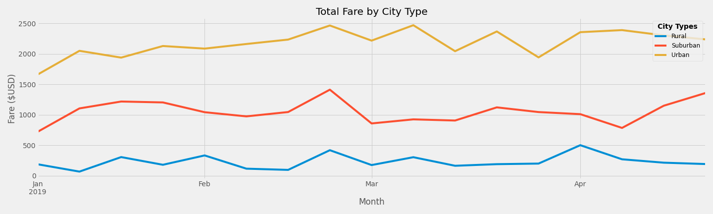

# PyBer Analysis

## Overview
Perform data analysis for a ride share company called PyBer.

- Calculate five metrics by City Type (Urban, Suburban, Rural) for 2019
    - Total Rides
    - Total Drivers
    - Total Fares
    - Average Fare per Ride
    - Average Fare per Driver
    
- Create multiple-line graph displaying total weekly fares for each city type - Urban, Suburban, Rural

## Analysis

### City Type Ride Share metrics

#### Rural
- The rural city type has far fewer total rides, total drivers, and total fares than the other two city types

- The Average fare per driver is highest for rural city types

- The Average fare per ride is higher than both Urban and Suburban city types.  But there are too few rides for the rural city type which results in very low total fares as compared to Suburban and Urban city types

#### Suburban

- Has 1,000 fewer rides than Urban city type and it's total fares is more than $20,000 dollars less than Urban city type

- Average fare per ride and Average fare per driver are higher than Urban city type.  The reason is most likely because Suburban has almost 2,000 fewer drivers than Urban city type

#### Urban

- Has highest total fares but its average fare per ride and average fare per driver are lowest of all city types.  This is probably due to the fact that the Urban city type has many more drivers than the other two city types

## Summary

The first recommendation is to remove the rural city type offering and transfer it's drivers onto the Suburban routes.  This will help improve Total fares for the Suburban city type.

The second recommendation is to transfer some drivers from the Urban cities to the suburban areas to address the large disparity in number of drivers among Urban and Suburban routes

Lastly, the fare for Urban rides should be increased in an effort to increase its average fare per rider/driver metrics

