# School District Analysis

## Overview
The analysis of standardized test scores for a school district will help in making strategic decisions regarding future school budgets and priorities. A potential issue of dishonesty arose with the 9th grade scores for Thomas High School.  This analysis will first remove the 9th grade scores for Thomas High School (THS) and the statistical metrics will be recalculated against this changed dataset. The new results will be compared to the original analysis that was performed on all grade levels (9th through 12th grades). Then the metrics for the math and reading and overall passing percentages will be calculated based on 10th to 12th grade scores from Thomas High School.

The original analysis is in the [PyCitySchools_Challenge_testing notebook](PyCitySchools_Challenge_testing.ipynb).  The new analysis is in the [PyCitySchools_Challenge notebook](PyCitySchools_Challenge.ipynb).

## Results
Show the effect on School District and School Summary analysis after changing Thomas High School 9th grade scores to NaNs ("Not a Number").

### School District

The following four changes in the school district analysis occurred as a result of replacing 9th grade scores for Thomas High School with NaNs.

<ins>School District Metrics affected</ins>

- **Average Math Score**<br/>
    The `Average Math Score` decreased by 0.1% from 79.0 to 78.9

- **% Passing Math**<br/>
    The `% Passing Math` on the School district report declined by 0.2%

- **% Passing Reading**<br/>
    The `% Passing Reading` declined by 0.1%

- **% Overall Passing**<br/>
    The `% Overall Passing` score at the School district level decreased by 0.3%.  It may not appear as a big change. But 0.3% of the total budget amount of $24,649,428 is $73,948 dollars which is significant if the total budget calculation is based on the `% Overall Passing` metric.

**School District metrics <ins>before</ins> changes to the data**

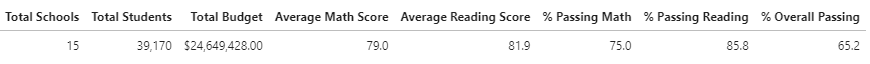

**School District metrics <ins>after</ins> changes to the data**

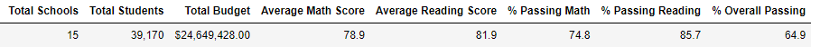


### School Summary
The Thomas High School `% Passing Math`, `% Passing Reading`, and `% Overall Passing` scores experienced a very large decline after changing the 9th grade scores to NaNs.

<ins>Thomas High School Metrics affected</ins>

- % Passing Math

- % Passing Reading

- % Overall Passing

**School Summary metrics <ins>before</ins> before changes to the data**

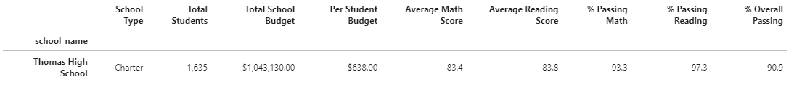

**School Summary metrics <ins>after</ins> reading and math scores for Thomas High School 9th graders were replaced with NaNs.**

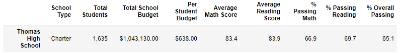

Prior to this change, the Thomas High School was among the five top schools in academic scores as measured by `% Overall Passing`. After changing 9th grade scores to NaNs, Thomas High School is no longer among the top performing schools. Relative to other charter schools, Thomas High School ranks at the bottom in comparison to its peers after this change was made.

```python
# Get list of schools for School Type = "Charter"
school_filter = (per_school_summary_df["School Type"] == "Charter")
per_school_summary_df.loc[school_filter].sort_values(["% Overall Passing"], ascending=False)
```


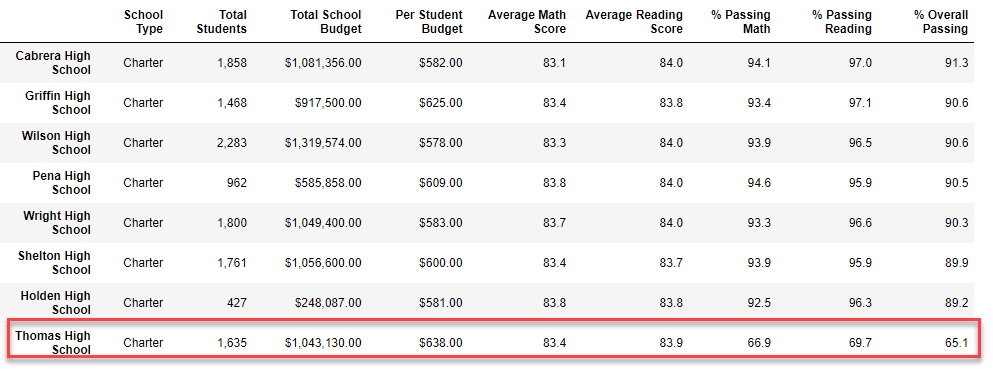


#### Analysis of Thomas High School 10th to 12th grade scores
Here the `% Passing Math`, `% Passing Reading`, and `% Overall Passing` columns were recalculated after excluding the THS 9th grade student scores. There appears to be only minor differences between the original and current analysis.

**School Summary for Thomas High School**<br/>

**Before changes to 9th grade scores**


**10th to 12th grade calculation**

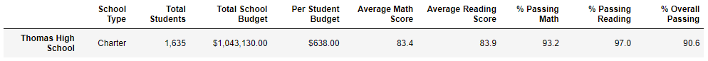

#### Average Reading and Math scores by grade

Both reports have missing values (nan) for Thomas High School, 9th grade.

#### Spending Ranges report
The effect of updating the 9th grade scores to NaN for Thomas High School has significantly changed the `% Passing Math`, `% Percent Passing Reading`, `% Overall Passing` metrics in the `$630-644` spending range in which Thomas High School belongs.  The new Spending Ranges report implies that schools in the `$630-644` range have an overall passing percentage below 60% and a % Passing Math below 70%.

**Before changes to 9th grade scores**

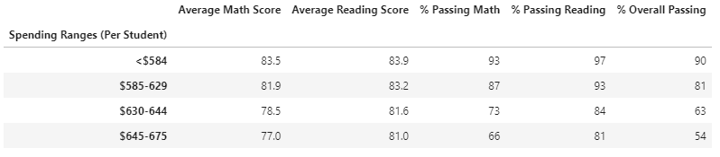

**After changes to 9th grade scores**

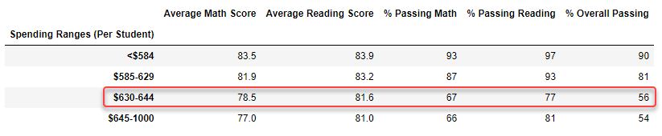

#### School Size Ranges report
Similar to the Spending Ranges report, there is significant effect on medium sized schools for the `% Passing Math`, `% Percent Passing Reading`, `% Overall Passing` metrics.  Changing the 9th grade scores to NaN for Thomas High School has affected these metrics for all medium sized schools.

**Before changes to 9th grade scores**

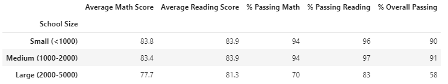

**After changes to 9th grade scores**

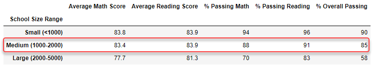

 
#### School Type report
The effect on this report may lead to inaccurate generalizations towards charter schools.  Would someone pay a lot of money to enroll in a prestigious charter school when the `% Overall Passing` is below 90%? The effect on this report also reduces the % Passing Math and % Passing Reading percentages.

**Before changes to 9th grade scores**
    
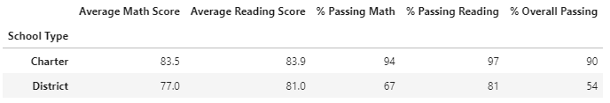


**After changes to 9th grade scores**

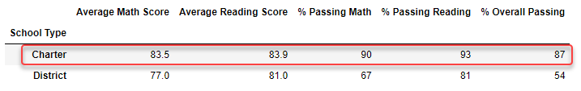
    
## Summary

### Four major changes from the School District Analysis

- Thomas High school is no longer among the top performing charter schools as a result of the dishonesty in the 9th grade scores. This is a major blow to Thomas High's reputation. 

- The Thomas High School received the most funding per student among charter schools. This is likely to change as enrollment is expected to decline as a result of the new analysis 

- The Thomas High School (THS) upper class students, grades 10 through 12, performed well but there future college applications may be impacted by the reputation damage incurred by THS. 

- Finally, this new analysis hurts charter schools in general as shown by the School Type report results after the Thomas High School 9th grade scores were removed from the analysis. 


