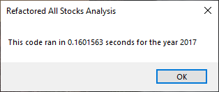
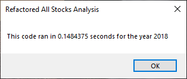

# Stock Analysis Using Excel VBA
This project uses Excel Visual Basic for Applications (VBA) to perform data analysis of stock returns data for a given year. In Excel VBA, one can define variables, arrays, conditionals, loops, and functions in order to build highly functional Excel solutions. The goal is to refactor an existing VBA function called **AllStocksAnalysis()** for performance and readability.


## Refactor VBA function and Measure Performance
There were four categories of code changes to the **AllStocksAnalysis()** function in the **VBA_Challenge.xlsm** workbook.  First, the new function will only make one pass through the source stock data rather than looping multiple times through the yearly stock records to calculate total volume and return. This was accomplished by using Excel VBA dynamic arrays.

To improve readability and maintainability of the Excel VBA function, the magic numbers in the function were eliminated.  A magic number is a hard-coded numeric value which can result in having to make additional code changes for when business requirements change. Magic numbers can also result in unexpected errors later on.  The last change was to use an Excel VBA variant array for setting the calculated values into the `All Stocks Analysis` worksheet.

### Analysis of Refactoring code

**1. <u>Loop through source data once</u>**

A performance improvement was gained by only having to iterate through the yearly stock source data one time.  On each pass of the data, the ticker symbol, ticker's total volume, and return is loaded into three separate arrays.  The arrays are created as dynamic arrays to only allocate the necessary memory resources for storing each array.

**2. <u>Create Dynamic Arrays</u>**

An example of the dynamic array declarations are listed below.  Each dynamic array is only allocated the memory space it needs.  As more tickers are added in the future analysis, the dynamic arrays will adjust automatically to accommodate the additional ticker values.

```vbnet
Dim tickerVolumes() As Long
Dim tickerStartingPrices() As Single
Dim tickerEndingPrices() As Single
	
Dim tickersUpperBound As Integer

tickersUpperBound = UBound(tickers)
ReDim tickerVolumes(tickersUpperBound)
ReDim tickerStartingPrices(tickersUpperBound)
ReDim tickerEndingPrices(tickersUpperBound)
```

The dynamic array is resized via the `Redim` declaration to specify the exact number of stocks to store.  The dynamic array maximizes memory usage and it minimizes the number of loop iterations for setting the results into the All Stocks Analysis worksheet.

**3. <u>Eliminate magic numbers</u>**

The magic numbers that were present in the original function were removed by deriving these values via Excel VBA functions. Excel VBA is used to derive the total number of rows in the source data instead of hard-coding the upper limit.  This allows for the source data to grow in size without breaking the Excel VBA function. 

```vbnet
'Get the number of rows to loop over
 rowCount = Cells(Rows.Count, "A").End(xlUp).Row
```
```vbnet
'2b) Loop over all the rows in the spreadsheet.
    For i = 2 To rowCount
```


The function to format Excel Cells was converted to using a `Do While` loop instead of iterating in a `For loop` for a specific number of times.  This eliminates the original magic number for the number of result rows and it prevents future issues in the event the number of result records increases such as when additional tickers are added to the analysis.

```vbnet
'Color cells based on whether Return is greater than zero
Dim rowIndex As Integer
rowIndex = 4

Do While Cells(rowIndex, "C").Value <> ""
    If Cells(rowIndex, "C").Value > 0 Then
        Cells(rowIndex, "C").Interior.Color = vbGreen
    Else
        Cells(rowIndex, "C").Interior.Color = vbRed
    End If
    rowIndex = rowIndex + 1
Loop
```

 
**4. <u>Use Variant array</u>**

Instead of directly setting the results into the Excel Cells individually, the resulting ticker, total volume, and return values are loaded into a VBA variant array. This is much more efficient than loading directly into the Excel Sheet cell-by-cell.  There may not be a noticeable performance improvement in this example since we only have twelve records in the final results.  However, performance gains will be more obvious as the final result increases to accommodate additional tickers in the future.

```vbnet
'Declare variant array
Dim allStocksArray As Variant
Dim allStocksArrayUB As Integer

allStocksArray = Range("A4:C15").Value
allStocksArrayUB = UBound(allStocksArray)

Dim r As Integer

'Looping inside arrays is faster than looping through Excel Cells
'https://support.microsoft.com/en-us/topic/visual-basic-macro-examples-for-working-with-arrays-a1067ada-ebe3-cca7-87a7-8d3ebbd70b6f
'https://bettersolutions.com/excel/cells-ranges/vba-working-with-arrays.htm
For r = 1 To allStocksArrayUB
    allStocksArray(r, 1) = tickers(r - 1)
    allStocksArray(r, 2) = tickerVolumes(r - 1)
    allStocksArray(r, 3) = IIf(tickerStartingPrices(r - 1) - 1 > 0, _
                            tickerEndingPrices(r - 1) / tickerStartingPrices(r - 1) - 1, _
                            0)
Next r

Range("A4:C15") = allStocksArray
```


### Performance Measurement
The new refactored VBA function called **AllStocksAnalysisRefactored()** performed much faster than the existing **AllStocksAnalysis()**.  For both 2017 and 2018, it took the existing function, **AllStocksAnalysis()** up to 1.15 seconds to complete.  The new refactored function, **AllStocksAnalysisRefactored()** completed in less than one second for 2017 and 2018.

#### AllStocksAnalysisRefactored() Results

**2017**<br/><br/>


**2018**<br/><br/>


## Summary of Refactoring VBA Code
There are pros and cons to refactoring code. On the plus side, refactoring can significantly improve the function's performance and maintainability over a long period of time. Refactoring code makes your code more stable and better able to handle future changes to requirements and unexpected events.  However, refactoring comes with a cost.  It takes a significant amount of time to refactor a function for performance and stability.  Oftentimes, one may have to rewrite the function in order to meet certain performance objectives which can increase the time it takes to complete the coding task. The process of refactoring also involves extensive testing which can increase the amount of time to complete a VBA function.  Before refactoring code, it is important to determine how often the function will be used and whether it will need to adapt to future changes.  If a VBA function is written for a one-time exploratory task then refactoring its code may not warrant the additional time and testing needed.

### Original VBA function - Pros and Cons
The original VBA function was easier to write and it took less time than the refactored version of this function.  The original function was also easy to test and it produced accurate results in a little over one second.  It was a good function for a one-time analysis of a limited number of stocks. The downside is if we ever need to use this VBA function for a larger set of tickers then performance could suffer. Also, it will be hard to maintain the original VBA function if we wanted to add new enhancements to it in the future.

### Refactored VBA function - Pros and Cons
The refactored VBA function runs in half the time as the original function for the same source data.  The refactored VBA function is more robust in that it can handle larger sets of tickers in the future with minimal impact to its performance. The refactored VBA function can also be enhanced with less effort if the need arises.  However, the refactored VBA function comes with a cost.  It took significantly longer to code and test. The refactored version of this function also required a steeper learning curve for some of the advanced features of VBA including dynamic arrays and variant arrays.  If we believe we will use this function frequently for additional tickers then the effort to refactor was worth it.

