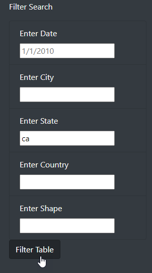

## JavaScript and Bootstrap for UFO Website

## Overview

Provide in-depth analysis of UFO sightings by allowing users to filter for multiple criteria at the same time such as date, city, state, country, and shape.

## Perform a Search

In the `Filter Search` section in left pane, enter one or more filters for viewing UFO sightings. After entering all of the filter criteria, click on the **Filter Table** button.

## Drawbacks

The `Filter Search` input fields are allowing users to enter bad data without any validation. Also, because there is no validation on what users enter as filter criteria. This web site is at risk for a SQL injection attack as shown in illustration below.

#### User can enter bad filter criteria

#### Possible SQL injection attack

## Recommendations

1. Add input validation to the `Filter Criteria` fields.  Clicking the `Enter Date` field should pop open a web calendar control for selecting a date.  The city, state, country, and shape fields should be converted to drop-down lists in order to restrict input to a predefined list of valid values.  This will prevent potential SQL injection attacks as well as prevent bad data from being entered into the filter criteria fields.

2. The output results should have the ability to sort on each header column when clicked.

